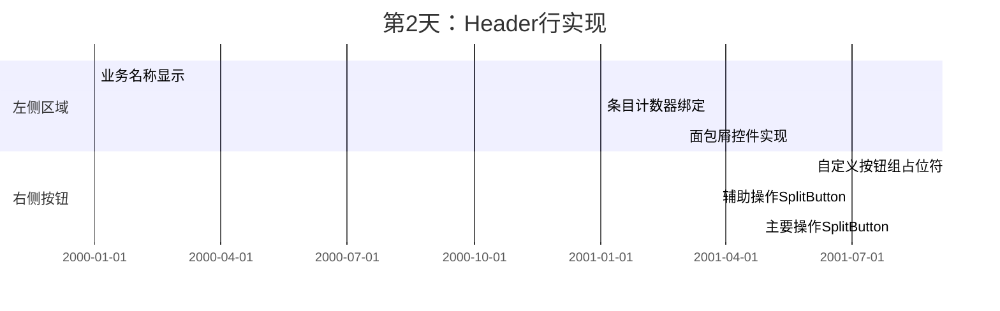
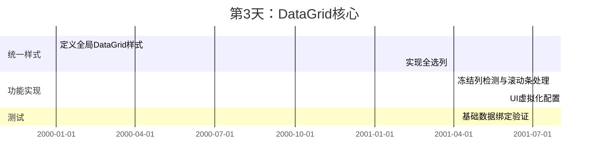
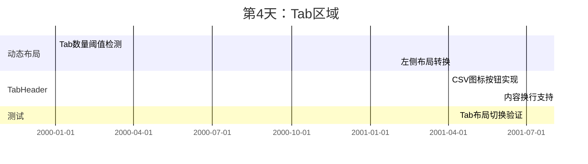
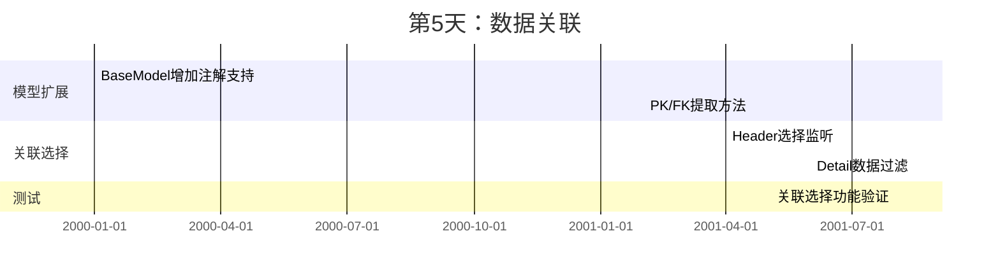
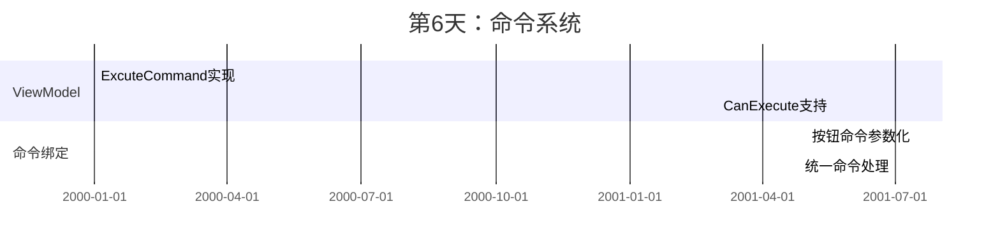
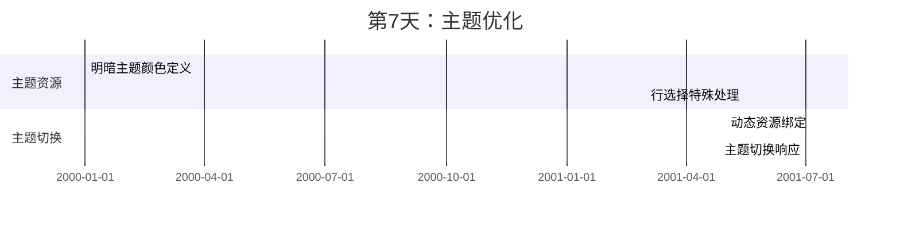
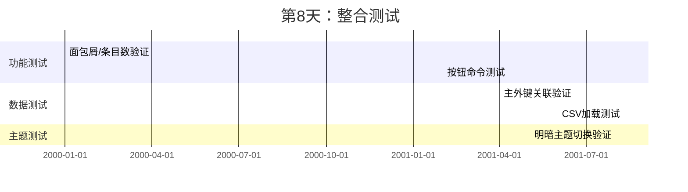
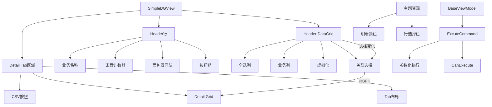

### 详细需求分析结果
需要实现一个通用UserControl，方便业务侧复用。
MVVM框架使用 mvvm toolkit 已经有了。
DataGrid使用 Avalonia.Controls.DataGrid，需要安装 Avalonia.Controls.DataGrid 包。

#### 1. 基础布局结构
| 组件             | 需求描述                                                                                                      | 补充说明                               |
|------------------|-------------------------------------------------------------------------------------------------------------|----------------------------------------|
| **整体结构**     | 三行Grid布局：Header行 + Header DataGrid行 + Detail Grid行                                                  | 布局需动态调整                          |
| **高度比例**     | 当存在Detail时，Header DataGrid行与Detail行的比例固定为1.2:1                                                | 无Detail时Header DataGrid占满空间      |

#### 2. Header行组件
| 元素               | 需求描述                                                                                                  | 交互细节                              |
|--------------------|---------------------------------------------------------------------------------------------------------|---------------------------------------|
| **业务名称**       | 通过依赖属性设置                                                                                       | 静态文本显示                          |
| **条目计数器**     | 显示Header DataGrid的条目数量                                                                           | 默认显示0，实时更新                    |
| **面包屑导航**     | 字符串集合拼接为"AA > BB > CC"格式                                                                        | 支持Tooltip，超长时中间部分显示"..."    |
| **自定义按钮组**   | 由业务侧定义，不存在时不显示                                                                            | XAML中定义                            |
| **辅助操作按钮组** | SplitButton: 默认"CSV读取"，下拉项["从ERP读取","CSV出力","模板下载","删除选中"]                        | 命令参数化执行                        |
| **主要操作按钮组** | SplitButton: 默认"推送到ERP"，下拉项["更新ERP","推送历史"]                                              | 命令参数化执行                        |

#### 3. DataGrid规范
| 特性                 | 需求描述                                                                                                  | 实现要点                              |
|----------------------|---------------------------------------------------------------------------------------------------------|---------------------------------------|
| **统一样式**         | 所有DataGrid应用相同样式                                                                                | 定义在App.xaml资源中                  |
| **首列**             | 固定全选列(绑定IsChecked)                                                                                | 业务侧不可覆盖此列样式                |
| **列定义**           | 其余列由业务侧在XAML定义                                                                                 | 支持单元格编辑                        |
| **交互限制**         | 禁用排序、列移动、增删行                                                                                 | CanUserSortColumns=false等             |
| **滚动条**           | 纵向滚动条自动显示；冻结列时显示横向滚动条                                                                 | 基于FrozenColumnCount判断             |
| **数据绑定**         | 绑定至BaseModel子类                                                                                      | 实现IsChecked属性                     |
| **主外键关联**       | 通过[PrimaryKey]/[ForeignKey]注解定义                                                                     | 选择Header行时自动筛选关联Detail数据  |
| **虚拟化**           | 启用UI虚拟化优化性能                                                                                     | VirtualizingStackPanel启用            |

#### 4. Detail区域
| 特性                 | 需求描述                                                                                                  | 条件判断                              |
|----------------------|---------------------------------------------------------------------------------------------------------|---------------------------------------|
| **显示条件**         | 无Detail Grid时隐藏整个区域                                                                             | Visibility绑定                        |
| **Tab布局**          | ≤5个Tab：Header在顶部；>5个Tab：Header在左侧                                                             | 切换阈值=5                            |
| **TabHeader**        | 左侧布局时固定宽度，支持内容换行                                                                         | 宽度=150px                            |
| **CSV图标**          | 每个TabHeader旁添加CSV读取图标按钮                                                                       | 点击加载CSV到对应Detail Grid          |

#### 5. 命令系统
| 特性                 | 需求描述                                                                                                  | 实现方式                              |
|----------------------|---------------------------------------------------------------------------------------------------------|---------------------------------------|
| **命令处理**         | 辅助/主要操作按钮使用统一ExcuteCommand                                                                   | 通过CommandParameter区分操作类型      |
| **BaseViewModel**    | 实现ExcuteCommand和CanExecute                                                                            | IRelayCommand接口                     |

#### 6. 主题与样式
| 特性                 | 需求描述                                                                                                  | 资源定义位置                          |
|----------------------|---------------------------------------------------------------------------------------------------------|---------------------------------------|
| **双主题支持**       | 明暗主题切换                                                                                             | App.xaml资源字典                      |
| **行选择颜色**       | 特殊处理DataGrid的行选择颜色                                                                              | 动态资源绑定                          |

---

### 详细实行计划（8天）

#### 第1天：框架搭建与基础DP

```mermaid
gantt
    title 第1天：框架搭建
    dateFormat  X
    axisFormat %s
    section 控件创建
    创建SimpleDGView控件           :0, 1
    定义三行Grid布局                :1, 2
    section 依赖属性
    定义BusinessName属性            :2, 3
    定义BreadcrumbItems属性         :3, 4
    定义DetailTabs集合属性          :4, 5
    section 测试
    基础布局渲染验证                :5, 8
```


#### 第2天：Header行实现


#### 第3天：DataGrid核心功能


#### 第4天：Tab区域实现


#### 第5天：数据关联逻辑


#### 第6天：命令系统集成


#### 第7天：主题集成与优化


#### 第8天：整合测试与验收


---

### 关键实现代码片段

#### 1. 面包屑截断逻辑
```csharp
private string GetTruncatedBreadcrumb(IList<string> items)
{
    if (items == null || items.Count == 0) return "";
    
    const int maxLength = 30;
    var fullPath = string.Join(" > ", items);
    
    if (fullPath.Length <= maxLength) 
        return fullPath;
    
    return $"{items.First()} > ... > {items.Last()}";
}
```

#### 2. Tab布局切换
```csharp
private void UpdateTabLayout()
{
    if (TabControl == null) return;
    
    TabControl.TabStripPlacement = DetailTabs.Count > 5 
        ? Dock.Left 
        : Dock.Top;
    
    if (TabControl.TabStripPlacement == Dock.Left)
    {
        TabControl.Width = 150;
        TabControl.HorizontalContentAlignment = HorizontalAlignment.Stretch;
    }
}
```

#### 3. PK/FK提取方法
```csharp
public static object[] GetPrimaryKeys(object entity)
{
    return entity.GetType()
        .GetProperties()
        .Where(p => Attribute.IsDefined(p, typeof(PrimaryKeyAttribute)))
        .Select(p => p.GetValue(entity))
        .ToArray();
}
```

#### 4. 命令处理核心
```csharp
public IRelayCommand<string> ExecuteCommand => new RelayCommand<string>(
    ExecuteOperation,
    CanExecuteOperation
);

private void ExecuteOperation(string commandType)
{
    switch (commandType)
    {
        case "CSV出力":
            ExportToCsv();
            break;
        case "删除选中":
            DeleteSelectedItems();
            break;
        // ...其他命令处理
    }
}
```

#### 5. 主题敏感资源
```xaml
<DataGrid.Resources>
    <SolidColorBrush x:Key="SelectionBrush" 
                    Color="{DynamicResource {x:Static SystemColors.HighlightColorKey}}"/>
</DataGrid.Resources>
```

---

### 测试计划矩阵

| 测试类别       | 测试用例                  | 验证点                                 | 通过标准                     |
|----------------|--------------------------|---------------------------------------|----------------------------|
| **布局渲染**   | 无Detail数据             | 第三行隐藏，第二行占满高度             | 高度比100%                 |
|                | 有Detail数据             | 第二/三行高度比1.2:1                  | 高度比例正确                |
| **Header行**   | 长面包屑                 | 截断显示，Tooltip完整                  | 显示"AA>...>CC"            |
|                | 条目计数                 | 随Header数据变化                       | 实时更新                    |
| **按钮系统**   | 辅助操作下拉             | 包含4个预设命令                       | 完整显示                    |
|                | 命令参数传递             | 点击按钮传递正确参数                  | ViewModel收到正确命令类型    |
| **DataGrid**   | 全选功能                 | 全选勾选状态同步                      | 所有IsChecked更新           |
|                | 冻结列                  | 显示横向滚动条                       | 水平滚动条可见              |
| **Tab区域**    | 4个Tab                  | Header在顶部                         | 顶部布局                    |
|                | 6个Tab                  | Header在左侧，固定宽度               | 宽度=150px                 |
| **数据关联**   | 选择Header行            | 自动过滤关联Detail数据               | Detail只显示关联数据        |
| **主题**       | 切换暗主题              | 行选择颜色适配                       | 选择色不刺眼                |
| **性能**       | 10000行数据             | 滚动流畅无卡顿                      | 帧率>30fps                 |

---

### 依赖关系图



